# PointAPI开放平台
- 基于 React + Spring Boot + Dubbo + Gateway 的 API 接口开放调用平台。
- 管理员可以接入并发布接口，可视化各接口调用情况，管理用户，文章
- 用户可开通接口调用权限、浏览接口及在线调试，并通过客户端 SDK和 ak / sk 调用接口，
发布文章，评论，点赞，收藏等
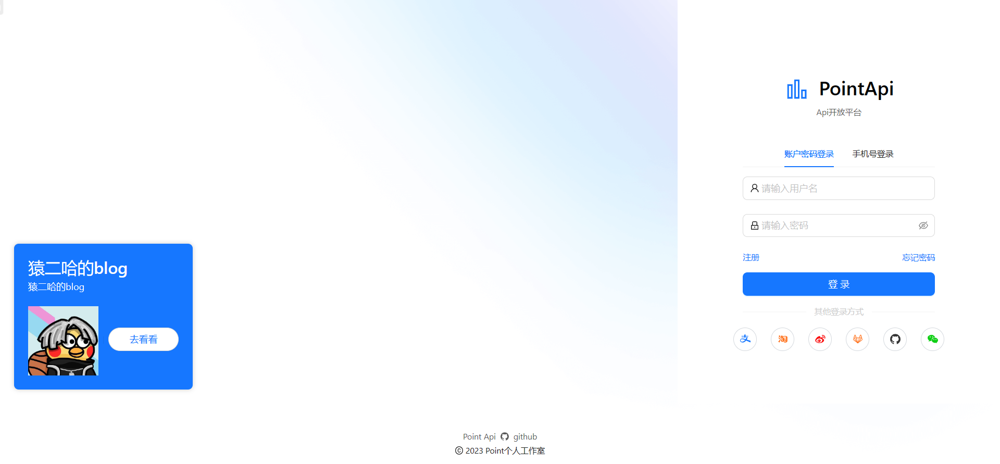
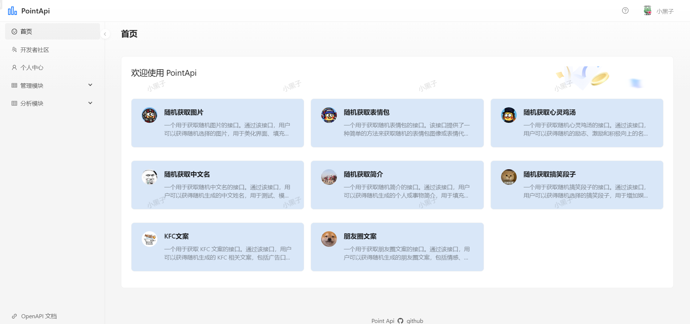
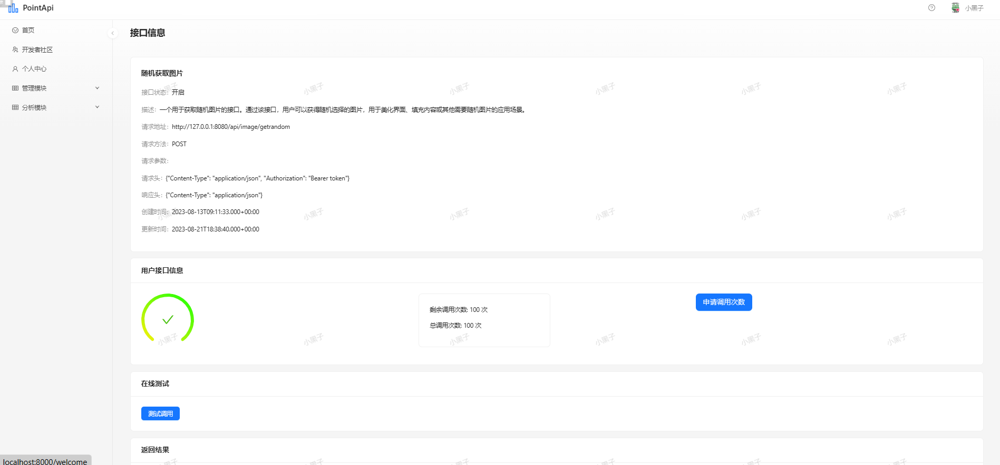
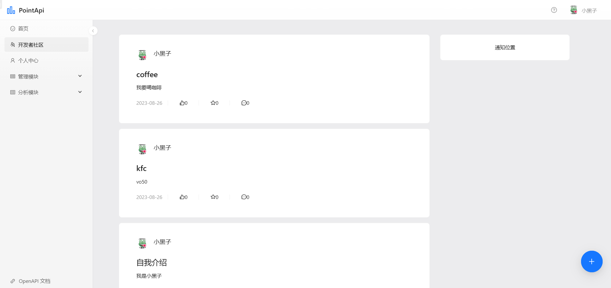
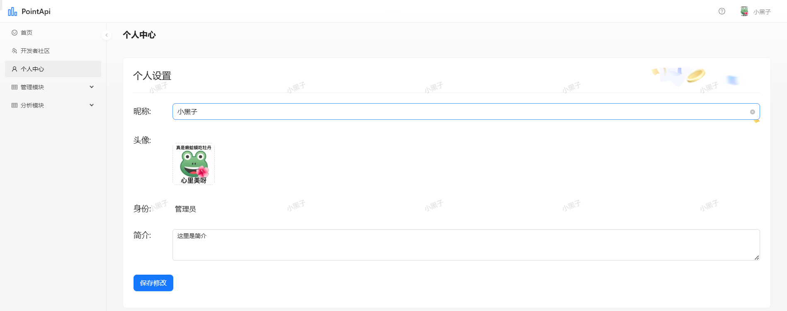
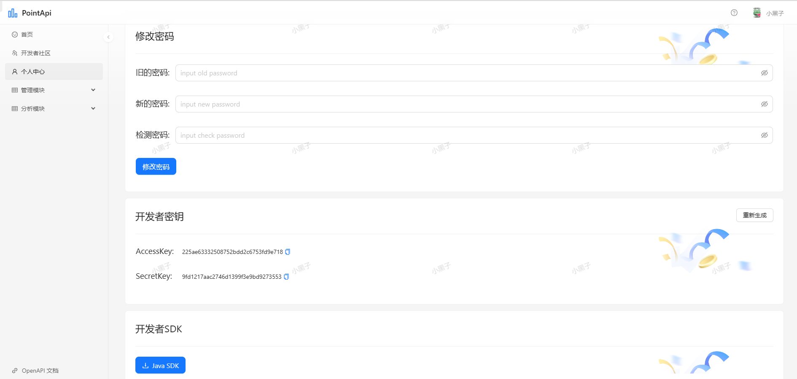
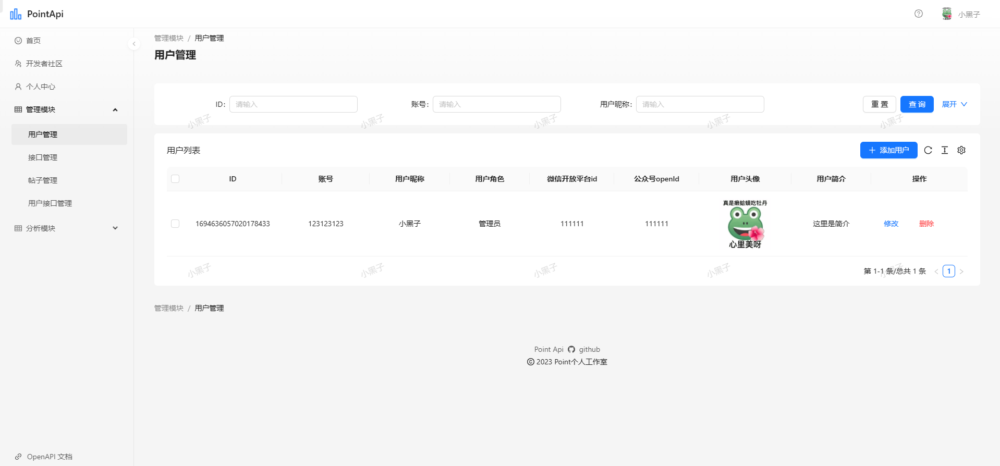
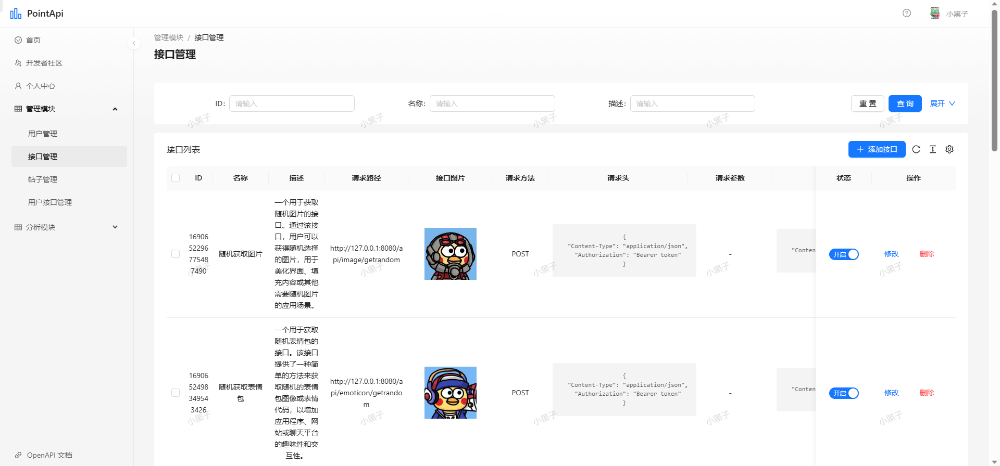
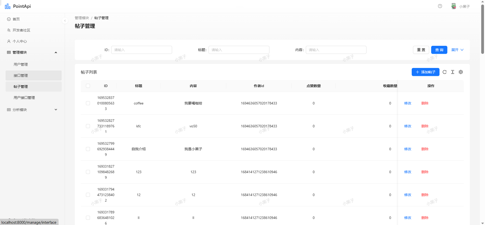
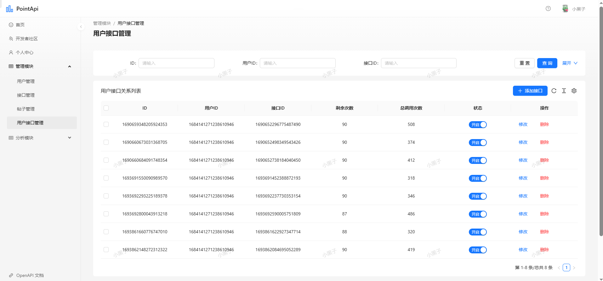
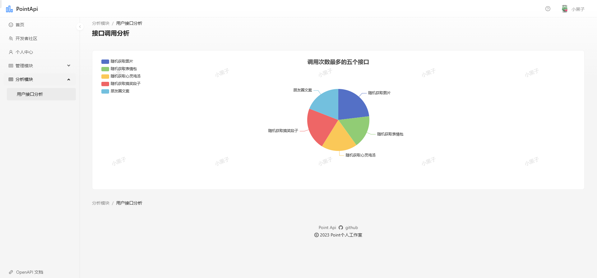
# 后端系统：pointapi_backend
- 用户：登陆，注册（ak/sk），注销，获取列表
- 接口：创建，上线，下线，删除，获取接口的信息（注解管理员）
- 接口调用分析：分析接口调用的次数
- 接口用户关系：创建，删除，更新，获取列表
- 文章：发布，评论，点赞，收藏

# 接口模块：pointapi_interface
- image：随机获取图片
- emoticon：随机获取表情包
- chickensoup：随机获取心灵鸡汤
- cnname：随机获取中文名
- profile：随机获取简介
- interestpost：随机获取搞笑段子
- kfccw：KFC文案
- pyqpost：朋友圈文案

# 公共模块：pointapi-common

- model：各种类：用户的类，接口的类，图片的类，文章的类
- service：dubbo的rpc调用
- exception：封装各种异常类
- constant：封装各种常量
- common：通用类

# 客户端 SDK：pointapi-client-sdk

- PointApiClient：发送网络请求的java类
- HeaderUtils：签名工具

# API 网关：pointapi_gateway

全局过滤器：
- 对接口的调佣次数进行累加：使用dubbo来实现
- 路由转发：将SDK中请求gateway的请求路径转发到api-interface的请求路径
- 流量染色：通过default-filters中加入- AddRequestHeader=Point-Request-Color, blue来实现
- 并集中处理签名校验：在请求中获取accessKey，nonce，timestamp，sign，body
- 根据ak查数据库，不存在直接报错
- 检查nonce：在client中生成6位的随机数，每次请求成功保存在redis中并设置ttl，
- 检查timestamp：不能超过五分钟
- 检查sign：查询数据库获取sk，含body将sk加密，比较
